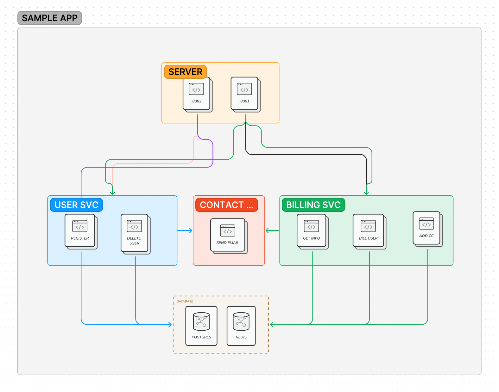

# Vertebrae

An application framework for building async Python microservices. Use this to add consistency between your API code bases. 

## How it works

1. Create a Vertebrae Server and attach applications (APIs) to it with defined Vertebrae Routes.
2. (optionally) Supply connection details to Postgres and/or Redis. Vertebrae will create async connection pools for each.
3. Convert your classes to Vertebrae Services. This creates a mesh network between them and supplies each with a handler to your databases.



> Above you can see two apps being served with three services available. Services can tap into the databases. 

## Get started

Start by loading your application properties into the ```Config``` object.
Next, create a server object containing ```applications``` and ```services```.
An application is an API that serves a list of routes at a specified port. A service is a standalone
Python class that contains business logic.

```python
from vertebrae.config import Config
from vertebrae.core import Server, Application

if __name__ == '__main__':
    Config.load(Config.strip(env='conf/env.yml'))
    server = Server(
        applications=[
            Application(port=8081, routes=[MyRoutes()])
        ],
        services=[
            BasicService(),
            NotifyService()
        ])
    server.run()
```

### Example: Config

When the app boots, the ```Config``` object is injected with an arbitrary YML file of your choosing. Any environment
variables with matching property names will overwrite the values in the file. Reference any property within your
app via ```Config.find(property)```.

> Below shows the required properties to connect to Postgres/Redis databases.

```yaml
postgres:
  database: frequency
  user: postgres
  password: ~
  host: localhost
  port: 5432
redis:
  host: localhost
```

### Example: Service

Each service must create a logger. Optionally, they can attach a handler to the database.

> Give your service an async ```start``` function to run an action when the application boots.


```python
from vertebrae.service import Service

class BasicService(Service):
    """ General functionality for this app """

    def __init__(self):
        self.log = self.logger('basic')
        self.database = self.db()

    def get_account(self, request):
        pass
```

### Example: Route

A route class must contain a ```routes``` function which returns a list of ```Route``` objects.
These represent your API handlers. Note how services can be engaged throughout your application.

```python
from vertebrae.core import Route
from vertebrae.service import Service

class UniversalRoutes:

    def routes(self) -> [Route]:
        return [
            Route(method='GET', route='/account', handle=self._get_account)
        ]

    async def _get_account(self, request: web.Request) -> web.json_response:
        resp = await Service.service('basic').get_account(request)
        return web.json_response(resp)
```